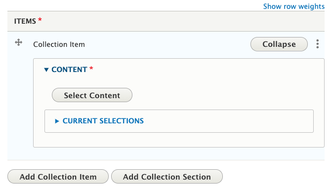

# Collection

## What Is a Collection

A grouping of existing pieces of educational content. Examples:

  - A series of articles or documents that make up a course
  - Content for a specific audience

Collections must be maintained by the content team. This can be time consuming. As new content is added to the website, it must also be manually added to the collection. This doesn’t happen automatically as it would for content tagged with a Topic (see [Displaying and Organizing Content on Other Pages](../managing-content.md#displaying-and-organizing-content-on-other-pages) for more information). Collections may have gaps if new content is not added or if all related content wasn’t added when first creating the collection.

Collections serve a specific purpose and are not a solution for all needs, especially where the website is helping to organize the content too. You don’t usually need a collection for grouping content based on geographical region or topic. Filters on topic pages can accomplish this.

## Who Can Add Collections

Members of Content Team groups.

## Instructions for Collections

Before you create a collection, be sure to find (or add to the site, if needed) all the content that should be part of it.

To create a Collection, go to your My Groups page and select the appropriate *Content Team* group. Then, click the "Create Collection" button at the top of the page.

On the edit screen for a collection, you will see the following fields:

  - **Introduction**: text that will appear before the collection items
  - **Items**: the pieces of content in the collection
    - To add a piece of content, click “Add Collection Item.” Then click the “Select” button to open the content browser and select the piece of content.

      

    > **Troubleshooting Tip**: The content browser allows you to select multiple pieces of content for a single collection item. However, we recommend selecting only one at a time. This makes it easier to organize content: collection items can be reordered, but pieces of content in a single collection item will always be in the order they were selected.

    - To organize content into sections with titles, click “Add Collection Section.” This will provide you with fields where you can specify the title of the section and the pieces of content that appear in that section.

  - **For More Information**: text that will appear after the collection items
  - **Tags**: information about the collection to help with display, sorting, search, and promotion. See below for more details.
  - **Teaser settings**: thumbnail and short description that display in the collection's teaser. If the thumbnail is empty, it will use a default image based on the topic.
  - **Author and Publishing Information**: information about the content for future maintenance
    - If the content’s author is an OSU Extension employee, start typing their name into the first “Author(s)” field and select them when they come up. This will associate the content with their profile on the site.
    - If the content’s author is not an OSU Extension employee (including OSU employees who don’t have an Extension appointment), enter their information in the “Non-Extension Author(s)” fields.

## How and Where Collections Display

Collections display just like articles, educational documents, and other pieces of educational content. They display on topic and program pages based on the tags in the “Topics, Keywords, Programs, and Regions” section of the edit screen.

  - **Topic**: It will show in the “Browse All Resources” page for the specified topic(s). Other content tagged with the topic will show at the bottom of the collection in a “Related Resources” section.
  - **Program**: If the specified program has added a “Program Tagged Content List” section to one of its pages, it will show up there. See the [Subpage](#subpage) section for more information.
  - The other tags available to fill in are used for internal marketing purposes and/or populating the filters visitors use in search results or on topic pages.

Counties and Programs can feature Collections on their pages by selecting them in a page section (for example, a "featured content" section).
