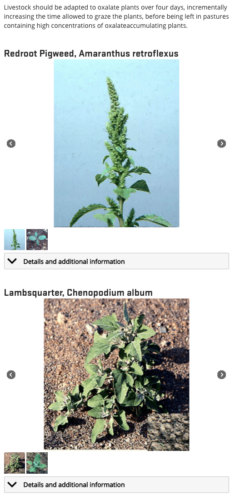

# Educational Gallery

## What Is an Educational Gallery

Content that is based on several collections of images. Examples may include a series of plant profiles or a "how-to" guide with photos for each step. See below for what this looks like:

## Who Can Add Educational Galleries

Members of Content Team groups.

## Instructions for Educational Galleries

To create an Educational Gallery, go to your My Groups page and select the appropriate *Content Team* group. Then, click the "Create Educational Gallery" button at the top of the page.

On the edit screen for an educational gallery, you will see the following fields:

  - **Introduction (required)**: text that shows above the images in the gallery to provide context. It will also show in the content's teaser if a short description isn't provided.
  - **Items (required)**: the items in the gallery
    - To add a piece of content, click “Add Educational Gallery Item.” You can then enter a name and description for the item and upload the photos.
    - To organize content into sections with titles, click “Add Educational Gallery Section.” This will provide you with fields where you can specify the title of the section and add items to that section.

  - **Short Description (required)**: a summary of the gallery’s contents that will show in the teaser
  - **Thumbnail**: the image that will show in the teaser. If this is empty, it will use a default image based on the topic tag.
  - **Tags (topic required)**: information about the content to help with display, sorting, search, and promotion. See below for more details.
  - **Author and Publishing Information**: information about the content for future maintenance.
    - If the content’s author is an OSU Extension employee, start typing their name into the first “Author(s)” field and select them when they come up. This will associate the content with their profile on the site.
    - If the content’s author is not an OSU Extension employee (including OSU employees who don’t have an Extension appointment), enter their information in the “Non-Extension Author(s)” fields.

## How and Where Educational Galleries Display

The tags in the “Topics, Keywords, Programs, and Regions” section of the edit screen determine where the educational gallery displays.

  - **Topic**: it will show in the “Browse All Resources” page for the specified topic(s). A link to the topic page for the topic will display at the end of the gallery. Other content tagged with the topic will show at the bottom of the gallery in a “Related Resources” section.
  - **Program**: If the specified program has added a “Program Tagged Content List” section to one of its pages, it will show up there. See the [Subpage](#subpage) section for more information.
  - The other tags available to fill in are used for internal marketing purposes and/or populating the filters visitors use in search results or on topic pages.

Counties and Programs can feature Educational Galleries on their pages by selecting them in a page section (for example, a "featured content" section).
