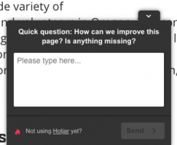
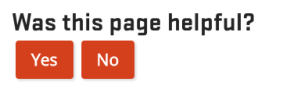
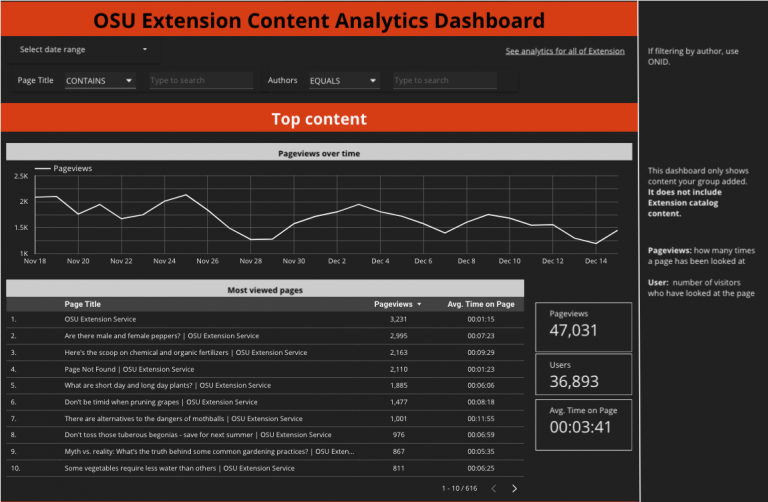

# Content feedback and analytics

For Extension’s digital strategy to be successful, we need to use data from visitors to decide how to create, maintain, and distribute content. There are features on the Extension website for content authors to find analytics and visitor feedback for their content.

## Visitor feedback

There are a few features on the Extension website that collect qualitative data. This type of data answers questions about content that can help improve its quality, such as:

  -	Did visitors find the information they were looking for?
  -	What did they do most often on the page?
  - Were they able to understand the content?

### How feedback is collected

The first feature is a **feedback widget** on the right-hand side of every page:

When a visitor clicks on the widget, a small window comes up asking them “Did you find what you were looking for?” They then score a page on a scale of 1-5 (represented by smiley faces). After they score the page, they have the opportunity to leave a comment. They may also enter their email address if they would like a response to the comment.

Another way of collecting visitor feedback is a **poll**. With a poll, we can ask more specific customized questions. For example, we have a poll set up on all 4-H pages that asks what is missing from the page. With this data, we wanted to improve visitors' experience during future fair seasons.

This window pops up from the bottom of the page after a visitor has had a chance to look around for several seconds. When they comment, they also have the option to leave their email address if they would like a response.

Finally, at the bottom of most pages, visitors see a small form asking **“Was this page helpful?”** They can select “Yes” or “No” and have an option to leave a (non-public) comment.

### Finding feedback on your content

To view feedback for a piece of content, go to the content and click the “Feedback” tab under the content’s title. It is near the “Edit” tab.

To see an overview of feedback scores for all content in a group, go to that group’s group content page. Then click the “Feedback” tab under the group name. This will take you to a list of all content with feedback in the group. To see the comments left for a particular piece of content, you can click on “Details” in its row on this page.

## Group analytics dashboard

There is an “Analytics” tab at the top of the group content page for each group. Clicking on this tab will take you to the analytics dashboard for the content in that group.

On the top of the dashboard, there is a link to “See analytics for all of Extension.” This expands the data on the dashboard to include all content on the Extension website. That way, you can see how your content compares.

### Data available on the dashboard

The dashboard is broken up into several sections:

  -	**Top content**: this section contains information about
      -	How often content from the group is viewed (pageviews)
      -	How many people visit the group’s content (users)
      -	How long on average that people spend viewing the content
      -	The most visited pages in the group

  -	**How visitors find us**: this section contains information about\
      -	The way that visitors find content produced by the group (see the help text on the right-hand side of the dashboard for definitions)
      -	Websites, both internal and external to OSU, that link to the group’s content

  -	**About the visitors**: this section contains information about
      -	The approximate locations of visitors who view  content from the group
      -	The preferred languages of visitors to the group’s content
      -	The types of devices used by visitors to access the content
      -	How many times visitors visit content in the group

-	**Visitor navigation**: you will see this section if you are a member of a program group. It shows information about the first and last pages visitors go to when they visit the group pages.
-	**What visitors look for**: this section is only on the dashboard for all content on the Extension website. It has information about the most common terms visitors enter in the search box on the website. It also shows the most common terms people enter that return no results.

### How to use the dashboard controls

There are several controls on the dashboard you can use to expand or restrict the data you see.

  -	Date range: this dropdown widget is at the top of the dashboard. You can use it to select the date range for the data shown on the dashboard.
  -	Page title: in the “Top Content” section, there is a widget you can use to see data about only a specific page or set of pages. To do this, type in the title of the page and press enter. If you don’t know the exact name of the page, you can click on the box that says “EQUALS”. This will reveal a dropdown where you can select “CONTAINS” instead.
  -	Search terms: in the “What visitors look for” section, you can filter to see if the search terms contain a particular word. To do this:
      -	Click on “EQUALS” to reveal a dropdown and select “CONTAINS”
      -	Type in the word you want to filter by and press enter

### How to interpret the data

The content analytics dashboard provides quantitative data about content. This means that you will need to interpret it to find actionable takeaways. Here are some tips for doing this:

  -	Identify gaps and opportunities.
      -	The “About the Visitors” section may show you audiences that you may not be effectively serving up to this point. Do you have content relevant to the places they are from? Do you have content in the language(s) they prefer?
      -	On the flip side, this section may reveal that audiences you have heavily focused on in the past are not using your content as often as you would like. If this is the case, you may need to do some outreach to figure out why this is or reconsider where you are directing your efforts.
      -	In the “How visitors find us” section, look at the sites that are linking to your content. Is your content appropriate for people coming from those sites? Are there any sites you know of that you would like to link to you?
      -	The “What visitors look for” section may identify topics visitors are interested in that your group has expertise in.
  -	Look for trends and outliers.
      -	In the “Top content” section, look for pages that are more popular than others or pages where people spend more time than average. Then, you can see what about that content  could help to bring the rest of your content up to that level.
          -	One way to do this for pages is to look at the feedback on the page.
      -	Also look at the pageviews over time graph at the top of the dashboard for times when pageviews spiked. Do you know why the spike happened? Can you make that happen again?
          -	If you don’t know where a spike in pageviews came from, try narrowing the date range for the dashboard to only that day and look at the “Where visitors come from” section.

## Key Takeaways

  - Content authors can see comments visitors have left on content by clicking on the "Feedback" tab when viewing the content.
  - Group members can access an analytics dashboard for their group's content by clicking the "Analytics" tab on the group content page.
