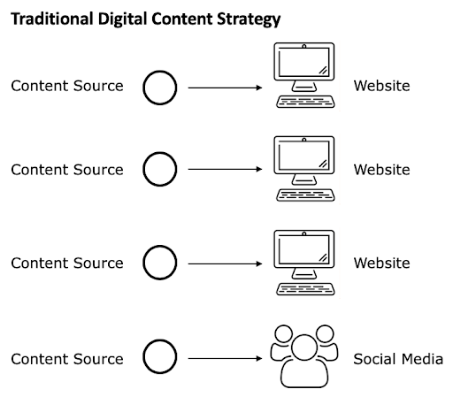
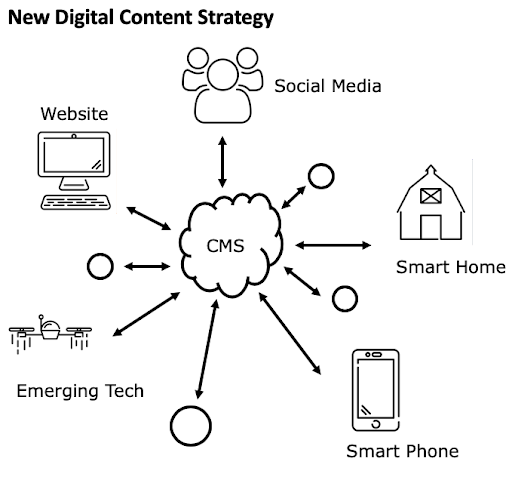

# Introduction: Extension’s Digital Strategy

The ways people seek and use information online are more diverse than ever. It has become obvious that there is no *one* best way to reach Extension’s audiences. Today, people get information from social media, smartphone apps, Google searches, smart home devices, and more. In the future, these channels will vary even more widely. We can be certain that as technology develops, the ways people use it will constantly change.

If Extension hopes to engage a wide audience and remain relevant, it needs digital content that is flexible and adaptive to these changes. Oregon State University Extension has developed a digital strategy to meet this need. This project aligns with similar initiatives in other colleges and organizations within OSU as well as the University itself. The University’s [Strategic Plan 4.0](https://leadership.oregonstate.edu/sites/leadership.oregonstate.edu/files/provost-documents/sp4-adjusted.pdf) includes goals such as:
  - “[deliver] distinctive and affordable education via multiple pathways”,
  - “retool the OSU experience for the 21st century learner”,
  - “coordinate marketing and communications across onsite, digital, and hybrid learning platforms”, and
  - “integrate and simplify technology systems, data practices and policies to increase our organizational agility.”

All of these goals align with Extension’s new digital strategy.

Extension’s digital strategy consists of two high-level objectives:
  1. Create a central “content management system” (CMS) for digital content that can provide a variety of feeds to devices and platforms.
  2. Implement a “customer relationship management” (CRM) system to deliver content in a personalized way.

## Content Management System

 | 
-------------------- | ---------------------

*The traditional way digital content is served vs. Extension’s new digital strategy.*

A content management system (or CMS) is a system that works like a database for content. Currently, we populate our CMS by entering content into the new Extension website. A CMS contains the content itself as well as information about the content such as its author and what it’s about. It can then feed the content to many different "channels,” including websites, social media feeds, smartphone apps, and smart home devices.

The goal behind a central CMS is to *meet people where they are* instead of trying to force them to come to us. To create a CMS that can fulfill this goal, our way of thinking about the content we enter needs to change. In particular, content in the new system needs to have the following characteristics:

  * **Centralized**: All content delivered by the CMS needs to be entered and stored in one place.
  * **Structured**: For diverse platforms to be able to parse content in useful ways, the content needs to have structure. Instead of putting a bunch of content in one text box on a page, it is better to organize that data into fields.
  * **Atomic**: "Atomic" means “of or forming a single irreducible unit or component in a larger system.” This means that we want to enter content in the system as the smallest possible (and sensible) pieces. Then the system can put them back together in different ways depending on the context.
  * **Described**: Computers are getting “smarter” all the time, but they always do better with a little human help. Authors should include information about the content in the system. This gives clues as to what the content is about, who it is for, and when it is appropriate to present.

### Case Study: Home Food Safety and Preservation Program  Publications
On the previous Extension website, this program created a page for its publications. Each publication is a PDF file containing information about a food preservation topic, and each PDF was a link on the page.

Instead of adding them all to the CMS as one long page of links like on the old site, content managers for the program entered each publication separately. Now the website can [list them all together for volunteers](https://extension.oregonstate.edu/mfp/publications) *and* [present them separately](https://extension.oregonstate.edu/search?search=canning+peaches) to visitors interested in a specific subject. Also, if authors need to update information, then they just need to change the publication once. It will be updated everywhere it shows on the site, which avoids broken links and reduces workload.

## Customer Relationship Management

The next phase of the digital strategy initiative will be to develop a customer relationship management (or CRM) system. A CRM system allows an organization to record a person’s interactions with them. In Extension’s case, this may include event registrations, newsletter subscriptions, financial contributions, and content viewed on our website.

A CRM system will allow us to interact with web-based learners and clients in a more constructive way. Previously, Extension presented content to visitors with little opportunity for conversation, feedback, or follow-up. Our new digital strategy will give Extension educators opportunities to build relationships through the web.

Extension will use Salesforce to be compatible with other groups across the university using it. This project is still in the early stages, but at this time, our priorities are to:
  - hire a Salesforce programmer to develop and implement the software;
  - provide a personalized digital experience to our clients that is relevant to their needs and interests and timely and accessible;
  - meet high standards of security and privacy; and
  - ensure that our clients are comfortable with their experience.

## The New Extension Website

The **new Extension website** that the public and our participants see is just one way people will get content from Extension. Content entered into the website populates Extension’s CMS. This will eventually also feed information out through social media, emails, and other technology.

The new Extension website was created in order to update our web platform according to the University’s policies. To follow the new digital strategy, the site was built with several guiding principles in mind.

  - **Customer focused**. The new website follows known customer preferences and bases menus and navigation on what customers want to do, learn, or search for, not on an internal topic or label.
  - **Mobile friendly**. The new website employs layouts and content that can be delivered in mobile-friendly ways.
  - **Data informed**. We use analytics and other data (e.g., needs assessments, trends) to support decisions.
  - **Relevant**. The site is built so content can be easily updated frequently. It implements processes that create less work for people, are easier with appropriate training, and are managed at the right level.
  - **Content focused**. It's about the content, not about the sites. The goal is to integrate or transition relevant content into the CMS rather than develop, host, or manage individual sites.
  - **Practical**. The new website allows faculty and staff to focus on content rather than website design, development, and management. The right people are doing the right things.

In June 2018, the new Extension website was launched as a minimum viable product. This means that not all features and design work was included that will be in the final product. Since launch, we have been collecting data and feedback and implementing improvements and new functionality. The first round of these improvements is underway and will be complete in early 2019.

## Review of Terms

  - **Content Management System** (CMS): a centralized source of content that feeds data to a variety of platforms, including the new Extension website
  - **Fields**: individual pieces of data that make up content. For example, a person’s faculty/staff profile would contain separate *fields* for their name, phone number, email address, etc.
  - **Customer Relationship Management** (CRM) **System**: a system that records the interaction between an individual and an organization, and maintains a database of contacts. It connects with the CMS and other tools to get relevant information to audiences.
  - **New Extension website**: the first of what will be many facets of Extension’s digital strategy. The content going into the Extension website will, in the future, also appear in other places (e.g. social media, email). This will be possible due to the way the content is entered and the existence of a content management system.

## Key Takeaways

  - Extension’s digital strategy will make our content available to clients that access information online in a variety of ways.
  - Content entered into the new Extension Website goes into a “content management system” that will feed into many channels. In order for this to be effective, content needs to be structured, atomic, and described.
  - The next phase in the digital strategy initiative will be to implement a “Customer Relationship Management” system.
