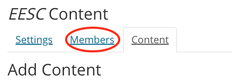
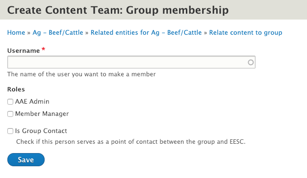

# Working with Other Content Authors

Extension’s digital strategy requires content authors to coordinate with one another proactively. This includes communication outside of the county, department, or office where you do your everyday work.

## Group Roles

The people you will be working most closely with are other members of your groups. Group members should work together to plan, enter, evaluate, and maintain their content. Key responsibilities for group members include:

  - evaluating and organizing existing content;
  - prioritizing content and identifying gaps;
  - revising and creating new content (as needed); and
  - entering content in the website (could designate a dedicated website editor).

Certain members of a group may have a specific role.

  - **Group leader** (also called “Group Contact”): the single point of contact and liaison between a content team and Extension Communications
  - **Member & Settings manager**: person or people responsible for adding members to the group

## Adding People to a Group

Member & Setting Managers in a group can add people to the group by going to the Group Content page for that group. At the top of the page, there is a “Members” tab.

When you click on that tab, you will go to a page where you can edit (add or remove roles) or remove existing members. You can add a new member by clicking the “Add Member” button at the top of the page.

*Screen for adding members to a group*

Enter the username of the person to add and check the box next to any roles the new member should have. Then click “Save.”

## Contacting a Group

You may need to contact another group if you need to request membership or ask for content to be added or edited. There are lists of groups and their members on the [Group contact dashboard](https://extension.oregonstate.edu/group/membership).

On this page, you can search for the group you are interested in by name, program area, or group type (content team, county, program, or topic committee).

  - To email an individual group member, use the "email" link in the row with their information.
  - To email all members of a single group, use the "Email all members" link under the name of the group, above the list of members.
  - To email the points of contact for all groups displayed, use the "Email group contacts from all displayed groups" button at the top of the page.

## Finding the Owner of a Piece of Content

If there are problems with a piece of content or you want to request a tag, you will need to find the person who entered the content. The content’s page lists its authors, but often the author is not the person who uploaded content to the site. This person is the content’s **uploader**.

You can find basic information about content, including its uploader and the group it belongs to, on the [Site Content Overview page](http://blogs.oregonstate.edu/extensionweb/content-teams/). (This page is also linked to from your “My Groups” page.)

*Content overview page*

On this page, you can find a piece of content by searching for its title. You can also search by its type, uploader, group, topic, region, keyword, language, or publishing status.

Clicking on the username in the “Uploaded by” column of a piece of content will take you to the uploader’s profile. There, you can find their contact information. Sometimes the uploader will need to refer you to the Group leader to make decisions about changes.

## Review of Terms

  - **Group leader**: the point of contact and liaison between a group and Extension Communications. Also called the “Group Contact” or “team leader.”
  - **Member manager**: a member of a group who is able to add and manage other members
  - **Uploader**: the person who added a piece of content to the site. May not be the same as the person who actually authored the content.

## Key Takeaways

  - Member managers in a group can add and manage other members in that group.
  - You can find basic information about a piece of content, including its uploader and the group it belongs to, on the Site Content Overview page.
